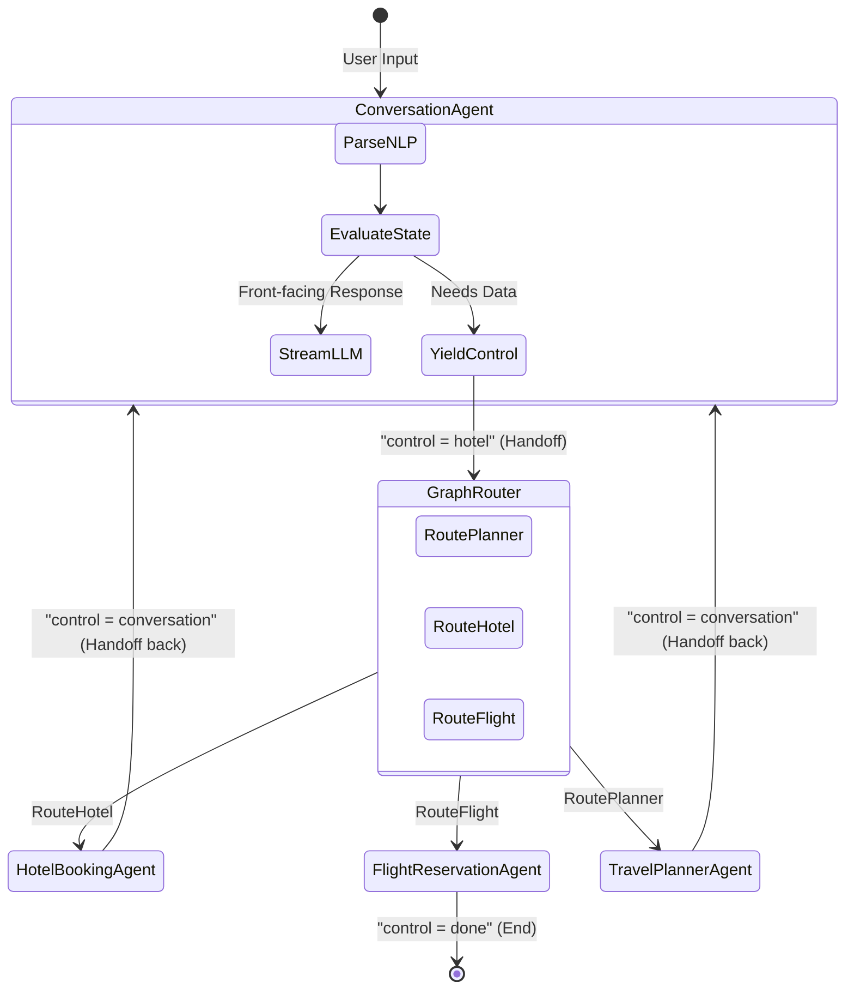
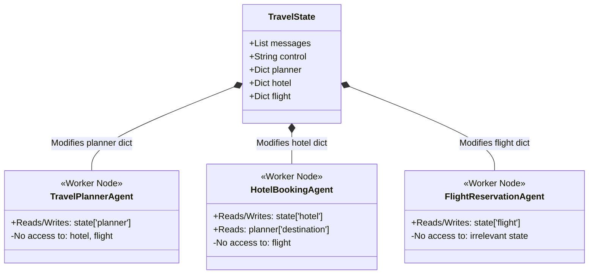
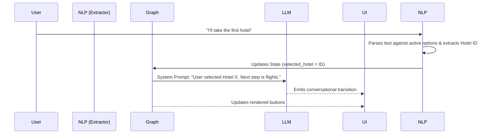

# 🛫 AI Travel Agent

> An intelligent, autonomous travel booking agent built with **LangGraph**, **FastAPI**, **React**, and **Supabase**.
> 
> **Created by Ahmed Hamdy**

[](https://fastapi.tiangolo.com/)
[](https://reactjs.org/)
[](https://python.langchain.com/v0.1/docs/langgraph/)
[](https://supabase.com/)

---

## 🌟 Overview

The **AI Travel Agent** is a full-stack AI-powered chatbot application that acts as a comprehensive travel concierge. Unlike standard chatbots that only answer questions, this system uses an **Agentic Workflow** (via LangGraph) to actively guide users through a multi-step booking process, interact with a real database (Supabase), and dynamically extract entities. 

The application now features a state-of-the-art **Premium Dark Theme** with glassmorphism UI/UX and a **100% Conversational Booking Engine** that allows users to select programs, hotels, and flights using natural language instead of mandatory buttons.

### ✨ Key Features

1. **Intelligent State Machine:** Powered by LangGraph to strictly manage the conversation flow (Destination -> Program -> Hotel -> Flight -> Confirmation).
2. **100% Conversational Booking (NLP Selection):** Users can type naturally like *"I want the first program"*, *"Select the expensive hotel"*, or *"Economy class"*. The AI's Natural Language Extractor parses the context of currently available options on the screen and seamlessly maps the user's conversational intent to the underlying database IDs. Buttons act merely as visual aids rather than mandatory inputs.
3. **Premium Glassmorphism UI:** A sleek, animated, and responsive Dark Mode interface built with modern CSS techniques (backdrop-blur, gradients, glowing borders) that mimics elite SaaS platforms.
4. **Real-time Database Integration:** Connects to Supabase to fetch live `travel_programs`, `hotels`, and `flights` based on the user's ongoing selections.
5. **Context Injection (Zero Hallucination):** The backend dynamically monitors the exact UI buttons presented to the user and injects them directly into the LLM's system prompt. This guarantees the AI knows exactly what the user is seeing and eliminates the "I haven't received the options yet" hallucination.
6. **Bilingual Support (English & Arabic):** The LLM autonomously detects the language of the user's input and generates context-aware, hyper-personalized responses.

---

## 🏗️ Architecture & Workflow

### 🌍 High-Level System Overview
The platform connects a modern React frontend in real-time to the Python LangGraph backend, interacting with Groq APIs for intelligence and Supabase for persistent data operations.

```text
┌──────────────────────────────────────────────────────────────────────────┐
│                             USER BROWSER                                 │
│  ┌──────────────────────────────────────────────────────────────────┐  │
│  │                   React + TypeScript (Vite)                      │  │
│  │                                                                  │  │
│  │   ┌─────────────────────┐         ┌─────────────────────────┐    │  │
│  │   │     Chat Panel      │         │   Dynamic Content Area  │    │  │
│  │   │  - messages (text   │         │   - program cards       │    │  │
│  │   │    & interactive    │         │   - hotel cards         │    │  │
│  │   │    buttons)         │         │   - flight options      │    │  │
│  │   │  - input box        │         │   - confirmation card   │    │  │
│  │   └──────────┬──────────┘         └────────────┬────────────┘    │  │
│  │              │                                 │                 │  │
│  │              └───────────┬─────────────────────┘                 │  │
│  │                          │                                       │  │
│  │               [user message / button click]                      │  │
│  └──────────────────────────┼───────────────────────────────────────┘  │
└─────────────────────────────┼──────────────────────────────────────────┘
                              │ WebSocket (wss:// in production)
                              ▼
┌──────────────────────────────────────────────────────────────────────────┐
│                         FastAPI Backend  :8000                           │
│                                                                          │
│  • WebSocket /chat – streaming + action handling                        │
│  • Optional REST endpoints (for non‑chat clients)                       │
│                                                                          │
│  ┌──────────────────────────────────────────────────────────────────┐  │
│  │                     LangGraph Agent Graph                         │  │
│  │                                                                   │  │
│  │  [START] ──control_router──► [conversation_agent]                 │  │
│  │                          ──► [travel_planner_agent]               │  │
│  │                          ──► [hotel_booking_agent]                │  │
│  │                          ──► [flight_reservation_agent]           │  │
│  │                          ──► [END]                                │  │
│  │                                                                   │  │
│  │   conversation_agent (GroqCloud):                                 │  │
│  │   - Understands intent                                            │  │
│  │   - Guides user through selection flow                            │  │
│  │   - Handles final CONFIRM action                                  │  │
│  │   - Streams tokens                                                │  │
│  └──────────────────────────────────────────────────────────────────┘  │
└─────────────────────────────────┬────────────────────────────────────────┘
                                  │ Supabase Python SDK
                                  ▼
┌──────────────────────────────────────────────────────────────────────────┐
│                         Supabase (PostgreSQL)                            │
│                                                                          │
│  travel_programs │ hotels │ flights │ bookings                           │
│  (exact schema as in your screenshots)                                   │
└──────────────────────────────────────────────────────────────────────────┘
```

The system is built on modern Multi-Agent principles, specifically tailored to satisfy two primary enterprise constraints: **Handoff Architecture** and **Strict Context Isolation**.

### 🤝 Sub-Agent Handoff Architecture
Instead of a single monolithic agent, the system employs specialized "Worker Agents" managed by a graph director. The interaction operates via strict "Handoffs" where control is explicitly yielded.



### 🔐 Strict Context Isolation (Don't Share Context)
To prevent cross-agent data contamination and LLM hallucination, Worker Agents are intentionally blinded to global state objects outside their domain. Standard memory/scratchpads are abandoned in favor of isolated sub-state dictionaries.



### 🧠 RAG Prompt Injection & UI Synchronization

The AI is prevented from hallucinating data by dynamically injecting both the database context AND the active UI state:



---

## 🎬 Demo

> Add your demo videos or GIFs here to showcase the project in action.

<!-- Demo Video 1 -->
<!-- Demo Video 2 -->

---

## 🚀 Getting Started

### 📋 Prerequisites
- **Python 3.10+** (Backend)
- **Node.js 18+** (Frontend)
- A **Supabase** Project (with your tables loaded)
- A **Groq** API Key — get one free at [console.groq.com](https://console.groq.com)

### 🛠️ Backend Setup

1. Navigate to the backend directory:
   ```bash
   cd backend
   ```
2. Install dependencies:
   ```bash
   pip install -r requirements.txt
   ```
3. Copy the example env file and fill in your values:
   ```bash
   cp .env.example .env
   ```
   Then open `.env` and set:
   ```env
   SUPABASE_URL=https://your-project-id.supabase.co
   SUPABASE_ANON_KEY=your_supabase_anon_key
   GROQ_API_KEY=your_groq_api_key
   ```
   > 💡 Find your Supabase URL and Anon Key in: **Project Settings → API**

4. Run the Uvicorn server:
   ```bash
   uvicorn api:app --reload
   ```
   *(The server will start on `ws://127.0.0.1:8000/chat`)*

### 💻 Frontend Setup

1. Navigate to the frontend directory:
   ```bash
   cd frontend
   ```
2. Install dependencies:
   ```bash
   npm install
   ```
3. Start the Vite development server:
   ```bash
   npm run dev
   ```
   *(The app will be available at `http://localhost:5173`)*

---

## Developed By

**Ahmed Hamdy**  
AI Engineer  

